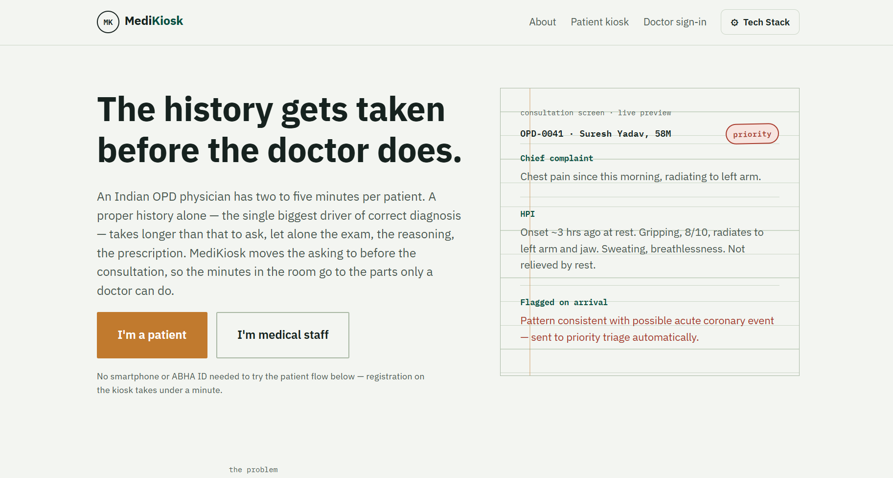
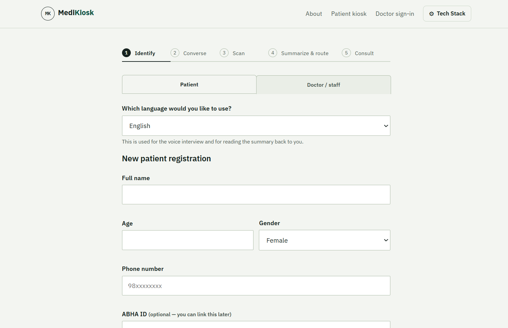
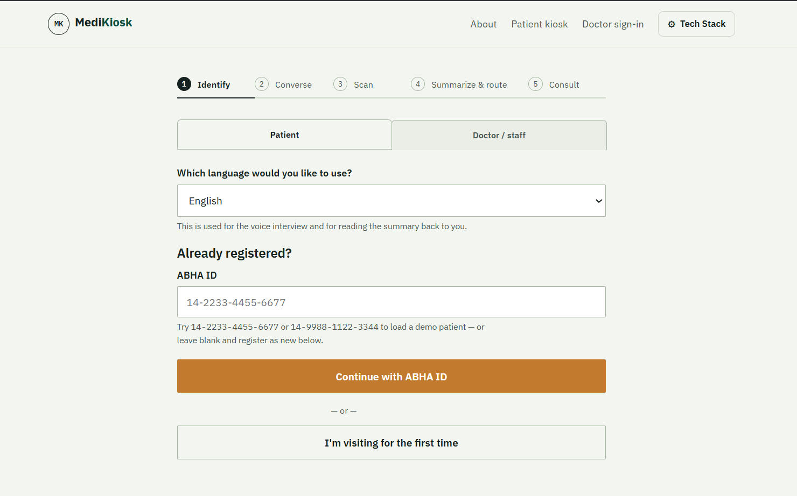
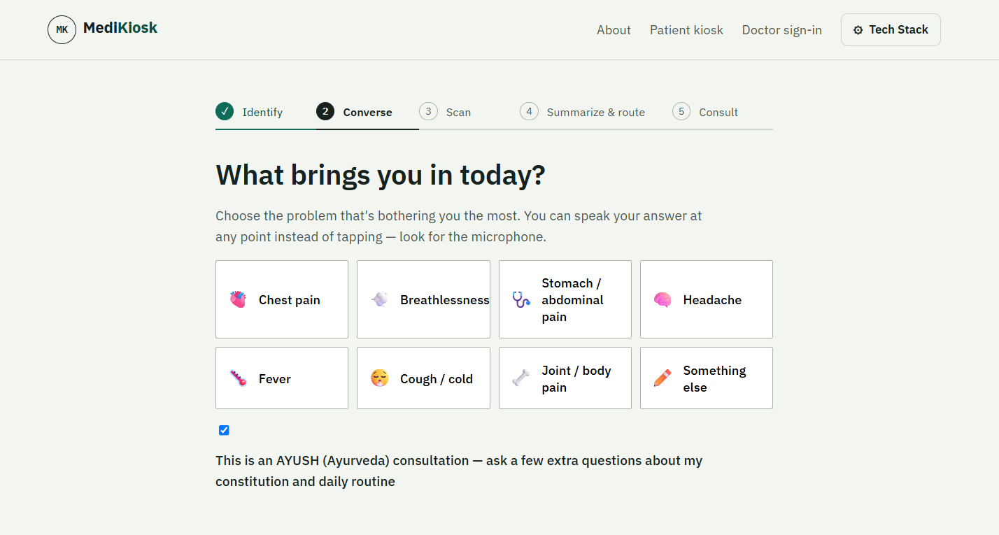
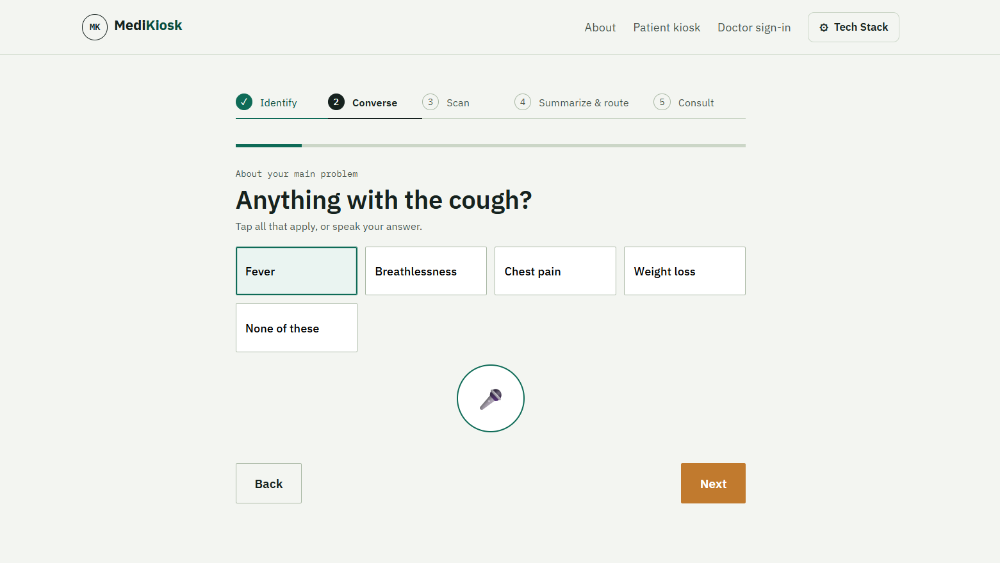
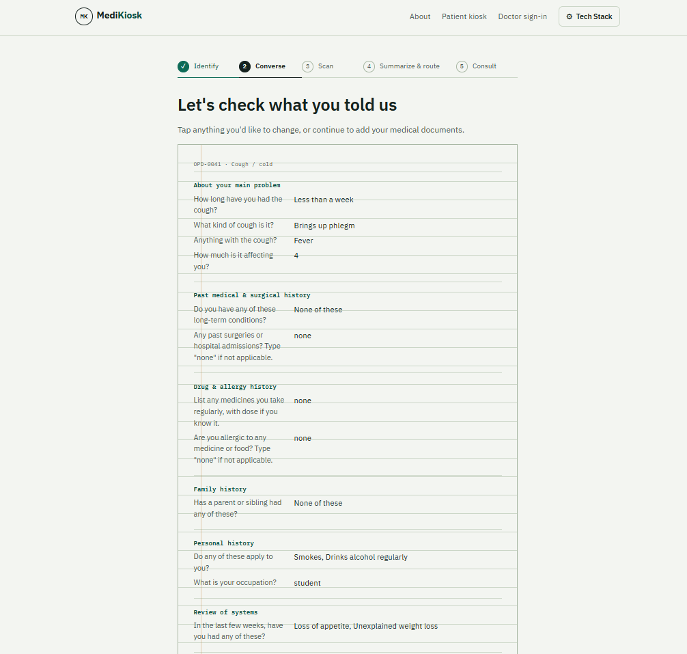

# MediKiosk AI

### AI-Powered Clinical History Taking & OPD Workflow Assistance

MediKiosk AI is a prototype designed to capture a patient's clinical history and prior medical information before consultation, helping make OPD visits more structured and efficient.

The system guides patients through an adaptive history-taking workflow and presents the collected information in a structured format for the doctor.

---

## 🚀 Live Prototype

**[Open MediKiosk AI →](https://jaideep-raj-cse.github.io/Medikiosk-AI/)**

**[View Source Code →](https://github.com/jaideep-raj-cse/Medikiosk-AI)**


---

## 📸 Prototype Screens

### 1. Landing Page

The MediKiosk landing page introduces the problem and provides separate entry points for patients and medical staff.



### 2. Patient Registration

Patients can register by entering basic information such as name, age, gender, phone number and optional ABHA ID.



### 3. Existing Patient / ABHA Flow

Returning patients can use their ABHA ID to load their existing profile and continue the consultation workflow.



### 4. Chief Complaint Selection

The system allows patients to select their primary health concern before beginning the adaptive history-taking process.



### 5. Adaptive History Taking

The prototype asks follow-up questions based on the patient's selected complaint, helping collect a more structured clinical history.



### 6. Structured Clinical Summary

Collected information is organized into a structured clinical history that can be reviewed before consultation.



---


---

## ⚙️ Key Features

- 🧑‍⚕️ Patient and medical-staff workflows
- 📝 Digital patient registration
- 🪪 ABHA ID-based patient lookup flow
- 🗣️ Guided clinical history-taking
- 🧠 Adaptive questions based on the selected complaint
- 🚨 Red-flag symptom identification
- 📄 Structured clinical history summary
- 📋 Prior medical document / investigation workflow
- 🌿 AYUSH assessment support
- 🏥 OPD consultation and priority-routing workflow
- 💾 Prototype local data storage and mock backend

---

## 🛠️ Technology Stack

| Technology | Purpose |
|---|---|
| HTML5 | Application structure |
| CSS3 | User interface and responsive styling |
| JavaScript | Application logic and workflow |
| Local Storage | Prototype data persistence |
| GitHub Pages | Prototype deployment |

---

## 🔄 Patient Workflow

```text
Patient Registration
        ↓
Identify / ABHA Lookup
        ↓
Chief Complaint
        ↓
Adaptive History Taking
        ↓
Medical Information & AYUSH Assessment
        ↓
Structured Summary
        ↓
Priority / Routing
        ↓
Doctor Consultation

---
```
---
---

## 🎯 Problem

In many OPD environments, a significant portion of consultation time can be spent collecting and documenting basic patient history.

Patients may also have previous medical documents, investigations, prescriptions, and other information that needs to be reviewed before or during consultation.

MediKiosk AI explores a digital pre-consultation workflow in which patient information can be collected and structured before the doctor begins the consultation.

---

## 💡 Our Solution

MediKiosk AI provides a guided digital workflow for collecting patient information before consultation.

The prototype:

- Collects the patient's basic information
- Identifies the patient's chief complaint
- Uses complaint-specific questions
- Collects relevant medical history
- Captures drug and allergy history
- Collects family and personal history
- Performs review-of-systems questioning
- Includes an AYUSH assessment workflow
- Processes prior medical-document information in the prototype
- Applies clinical red-flag rules
- Generates a structured clinical summary
- Provides a doctor-facing workflow for reviewing the collected information

---

## ✨ Key Features

### 1. Adaptive Clinical History Taking

The prototype provides different questions depending on the patient's chief complaint.

Supported complaint categories include:

- Chest pain
- Breathlessness
- Abdominal pain
- Headache
- Fever
- Cough / Cold
- Joint / Body pain
- Other complaints

---

### 2. Comprehensive History Collection

The workflow includes sections for:

- Presenting complaint
- History of present illness
- Past medical history
- Past surgical history
- Drug history
- Allergy history
- Family history
- Personal history
- Review of systems

---

### 3. AYUSH Assessment

The prototype includes an AYUSH-oriented assessment workflow covering:

- Prakriti
- Agni
- Koshtha
- Ahara–Vihara

---

### 4. Prior Medical Information

The prototype includes a demonstration workflow for extracting structured information from previous medical documents, such as:

- Laboratory values
- Investigations
- Prescriptions
- Discharge-summary information

---

### 5. Clinical Red-Flag Detection

The prototype includes rule-based checks for selected potentially concerning combinations of symptoms.

Examples include:

- Concerning chest-pain combinations
- Thunderclap headache
- Headache with neck stiffness or confusion
- Fever with neck stiffness or confusion
- Severe breathlessness
- Vomiting blood
- Coughing blood

These rules are intended as prototype safety flags and are not a diagnostic system.

---

### 6. Structured Clinical Summary

Collected information is organized into a structured summary containing sections such as:

- Chief complaint
- History of present illness
- Past history
- Drug / allergy history
- Family history
- Personal history
- Review of systems
- AYUSH assessment
- Prior investigations

---


---

## 🚧 Current Prototype Status

This repository contains a functional prototype demonstrating the MediKiosk patient intake and clinical history workflow.

The current implementation uses a mock backend and prototype data for demonstration purposes.

It is intended for hackathon and prototype demonstration and is **not a production medical system**.

---

## 🔮 Future Scope

Potential future development areas include:

- Integration with real clinical information systems
- Secure healthcare data storage
- Real authentication and authorization
- Integration with verified health-data standards
- Improved multilingual and voice interaction
- Advanced clinical decision-support capabilities
- Real-time hospital/OPD integration
- Deployment with appropriate healthcare security and privacy controls

---

## ⚠️ Disclaimer

MediKiosk AI is a prototype developed for demonstration and hackathon purposes.

It does not provide medical diagnosis or replace a qualified healthcare professional. Any clinical information shown in the prototype is intended for demonstration only.

---

---

## 🏗️ Prototype Architecture

```text
                    ┌─────────────────────┐
                    │     Patient /       │
                    │      Staff          │
                    └──────────┬──────────┘
                               │
                               ▼
                    ┌─────────────────────┐
                    │   MediKiosk UI      │
                    │  HTML + CSS + JS    │
                    └──────────┬──────────┘
                               │
             ┌─────────────────┼─────────────────┐
             │                 │                 │
             ▼                 ▼                 ▼
      Patient Intake     History Engine     Document Flow
             │                 │                 │
             ▼                 ▼                 ▼
      Patient Data       Adaptive Q&A      Prior Records
             │                 │                 │
             └─────────────────┼─────────────────┘
                               │
                               ▼
                    ┌─────────────────────┐
                    │ Structured Clinical │
                    │      Summary        │
                    └──────────┬──────────┘
                               │
                               ▼
                    ┌─────────────────────┐
                    │ OPD / Doctor        │
                    │ Consultation       │
                    └─────────────────────┘
